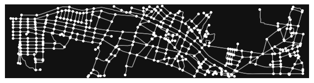
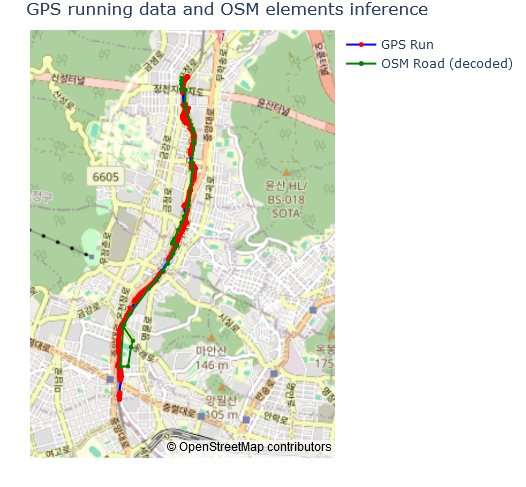
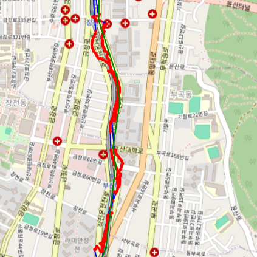
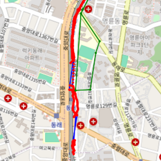

## Context

During my stay in Busan, I noticed that my running mobile application consistently overestimated the distance I ran. The reason is likely due to noisy GPS data, caused by the presence of tunnels I went through during my run, which degraded the quality of the GPS signals.

The goal of this small project is to develop a program for better estimating the actual distance of my runs done there. Of course, I could simply use Google Maps and its "measure distance" tool to calculate this manually in 30 seconds. Instead I spent 3 days implementing an automatic approach (:D).

## Implementation
I framed this as a "map-matching" problem ("Cartopondance" in French). Essentially, the task involves mapping GPS points to roads and walkable areas; For my map data, I used `OpenStreetMap` (OSM). Here is a visualization of the simplified OSM graph, where edges are representing portions of roads/paths:

To tackle the problem, I used a `Hidden Markov Model` (HMM) combined with the `Viterbi` algorithm. I assumed that:
- Emission probabilities follow a Gaussian distribution (which takes into account the fact that GPS points are noisy).
  
- Transition probabilities between connected nodes in the OSM graph are inversely proportional to the distance between them (with Laplace smoothing).
## Results
Here is a result for one GPS track:
| **Metric**                      | **Value**     | **Difference (%)** |
|----------------------------------|---------------|---------------------|
| Estimated distance (raw GPS points)        | 11.62 km      | +38.00%            |
| Estimated distance (decoded hidden states) | 8.71 km       | +3.44%             |
| Actual distance (gold value)     | 8.42 km       | 0.00% (baseline)   |

As you can see, the decoded states (portions of roads/paths) obtained from the ``HMM`` represents a more accurate approximation of the actual running path than raw GPS points (as it "cancels" the noise):

Though, it's not perfect, as it doesn't entirely conver all the actual running path. Also the model predicts some wrong states (but close):

## Conclusion

Surprisingly, results aren't too bad. 

For better results I could have introduced a Kalman filter to preprocess GPS points (make them less noisy beforehand), and to better estimate the predicted output (by taking into account the running speed);